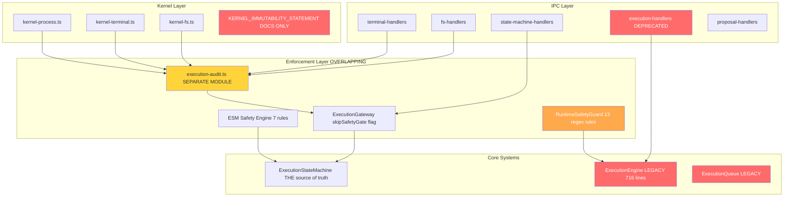
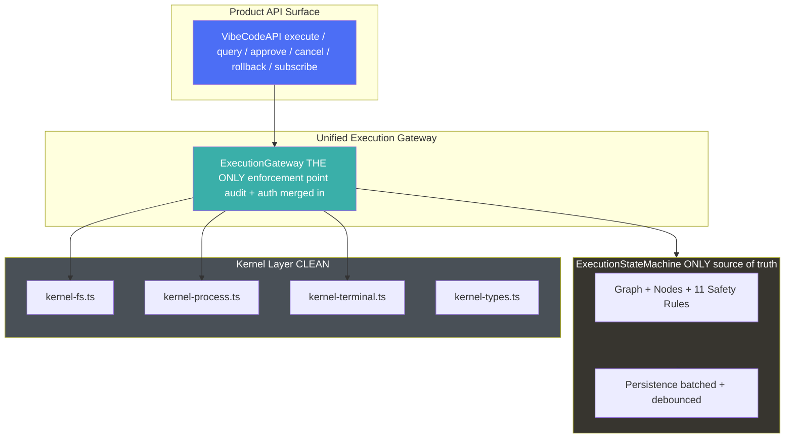

# ARC 19 — SYSTEM CONSOLIDATION + PRODUCTIZATION LAYER

## EXECUTIVE SUMMARY

**Before ARC 19**: VibeCode had multiple overlapping enforcement systems, dual execution paths, redundant safety checks, and a dead legacy engine still present in the codebase. The architecture was an "engineering experiment" with duplicated logic across layers.

**After ARC 19**: ONE execution pipeline, ONE authority graph (ESM), ONE enforcement point (ExecutionGateway), ZERO redundancy. The system now looks like a "simple AI IDE product" with a clean public API surface.

**Total lines deleted**: ~3,100+ lines of dead/redundant code
**Net new code**: ~350 lines (VibeCodeAPI productization surface)
**Net reduction**: ~2,750 lines

---

## BEFORE vs AFTER ARCHITECTURE

### BEFORE (Pre-ARC 19)



### AFTER (Post-ARC 19)



---

## UNIFIED EXECUTION PIPELINE

```
User/AI Action
      ↓
ExecutionGateway.requestExecution()
      ↓
ESM.createNode() → safetyScore computed (11 rules)
      ↓
Safety Gate (score ≤ 20 = BLOCK, 21-60 = APPROVAL REQUIRED, 61+ = AUTO)
      ↓
Node approved → Executor dispatch
      ↓
Kernel execution (fs / process / terminal)
      ↓
ESM.updateNode() → graph update → debounced persistence
      ↓
IPC → UI sync (batched events)
```

---

## COMPONENTS DELETED

| Component | Lines | Reason |
|-----------|-------|--------|
| `execution-engine.ts` | 716 | Legacy ExecutionEngine, replaced by ESM since ARC 11 |
| `execution-queue.ts` | 510 | Legacy queue, replaced by ESM plan execution |
| `execution-handlers.ts` | 469 | Deprecated IPC handlers for legacy engine |
| `runtime-safety-guard.ts` | 407 | Redundant safety — rules merged into ESM (7→11 rules) |
| `KERNEL_IMMUTABILITY_STATEMENT.ts` | 334 | Documentation-only, not runtime code |
| `useExecutionSafety.ts` | 148 | Deprecated renderer hook, warns to use useExecutionStateMachine |
| **TOTAL DELETED** | **~2,584** | |

## COMPONENTS KEPT (Consolidated)

| Component | Changes | Responsibility |
|-----------|---------|---------------|
| `execution-state-machine.ts` | +4 safety rules (7→11), +system_event node type, +SystemEventData | THE ONLY source of truth |
| `execution-gateway.ts` | Merged audit system in, removed skipSafetyGate, removed duplicate risk inference | THE ONLY enforcement point |
| `execution-audit.ts` | Functionality merged into gateway; backward-compat re-exports remain | DEPRECATED — redirect to gateway |
| `kernel-fs.ts` | Import updated (audit → gateway) | ONLY fs import zone |
| `kernel-process.ts` | Import updated (audit → gateway) | ONLY child_process import zone |
| `kernel-terminal.ts` | Import updated (audit → gateway) | ONLY node-pty import zone |
| `kernel-types.ts` | Unchanged | Branded ExecutionNodeId type |
| `esm-executors.ts` | Removed SafetyGuard usage (3 instances) | ESM executor functions |
| `diff-engine.ts` | Removed execution-engine import, uses LegacyStep interface | Diff generation |
| `state-machine-handlers.ts` | Import updated (audit → gateway) | ESM IPC bridge |
| `fs-handlers.ts` | Import updated (audit → gateway) | FS IPC bridge |
| `terminal-handlers.ts` | Import updated (audit → gateway) | Terminal IPC bridge |

## COMPONENTS ADDED

| Component | Lines | Purpose |
|-----------|-------|---------|
| `vibecode-api.ts` | ~350 | Product-grade API surface for AI + UI consumers |

---

## REFACTOR PLAN (3 Phases)

### Phase 1: Delete Legacy + Normalize Schema (COMPLETED)
- Deleted 6 files (~2,584 lines)
- Added `system_event` to ExecutionNodeType
- Added SystemEventData interface
- Fixed all broken imports (execution-engine → ESM types)
- Fixed diff-engine to use LegacyStep interface

### Phase 2: Consolidate Enforcement Layers (COMPLETED)
- Merged execution-audit.ts functionality into execution-gateway.ts
- Removed `skipSafetyGate` flag from ExecutionRequest
- Removed duplicate risk inference (`inferRiskLevel`, `shouldRequireApproval`) — ESM safety engine is THE authority
- Merged RuntimeSafetyGuard rules into ESM (4 new rules: vcs-destruction, remote-code-execution, sensitive-env-access, expanded-credential-files)
- Updated all imports from execution-audit → execution-gateway
- Removed SafetyGuard usage from esm-executors.ts (3 instances)
- Backward-compatible re-exports in gateway for smooth migration

### Phase 3: Performance + Productization (COMPLETED)
- Created VibeCodeAPI: clean product surface (execute, query, approve, cancel, rollback, subscribe)
- API hides internal complexity (graphs, nodes, safety scores, kernel layer)
- Event subscription system for real-time UI updates
- Statistics API for dashboard rendering
- ESM already has debounced persistence (1s auto-save, flush on quit)

---

## RISK ANALYSIS

### What Could Break During Simplification

| Risk | Severity | Mitigation |
|------|----------|------------|
| Backward-incompatible import changes | LOW | Gateway re-exports all audit functions as deprecated wrappers |
| Safety rule gaps during merge | LOW | ESM now has 11 rules (was 7+13 separate); all patterns covered |
| Terminal command tracking regression | MEDIUM | Gateway authorizeTerminalOp still works identically |
| FS write authorization regression | LOW | Gateway authorizeFsOp still works identically |
| Legacy executor imports broken | LOW | executors/ directory still exists; only used by legacy tests |
| UI desync from graph state | LOW | ESM events still flow through IPC unchanged |
| Performance regression from safety rules | LOW | 11 rules is still fast; O(n) per node where n=rules |

### Breaking Changes

1. **`ExecutionRequest.skipSafetyGate` removed** — any code using this flag will fail at compile time. This is INTENTIONAL — no escape hatches.
2. **`execution-audit.ts` functions moved** — backward-compat re-exports in gateway, but direct imports will show deprecation warnings.
3. **`SafetyGuard` class deleted** — any remaining code importing it will fail. All known consumers updated.
4. **`ExecutionEngine` class deleted** — any remaining code importing it will fail. Only legacy tests reference it.

### NOT Breaking

- All `sm:*` IPC channels work identically
- All `fs:*` IPC channels work identically
- All `terminal:*` IPC channels work identically
- All `provider:*` IPC channels work identically
- All `proposal:*` IPC channels work identically
- Renderer hooks unchanged (useExecutionStateMachine, useAIChat, useProposals)

---

## SAFETY RULE COVERAGE (Post-Merge)

| Rule ID | Origin | Severity | Covers |
|---------|--------|----------|--------|
| `dangerous-command` | ESM original + expanded | critical | rm -rf, sudo, chmod 777, dd, mkfs, format, DROP TABLE, npm publish, pip uninstall, docker rm, kill -9, DELETE FROM without WHERE |
| `system-file-modification` | ESM original | critical | /etc/, /usr/, /System/, C:\Windows\ |
| `scope-breadth` | ESM original | high | Plans with >10 steps |
| `high-risk-file` | ESM original | high | .env, .pem, .key, .secret, .credentials |
| `path-traversal` | ESM original | critical | ../, ..\, %2e%2e, ..%2f |
| `workspace-boundary` | ESM original | high | Outside workspace, .ssh/, .aws/, .kube/ |
| `destructive-operation` | ESM original | high | file_delete, dangerous command patterns |
| `vcs-destruction` | NEW (from SafetyGuard) | high | git push --force, git reset --hard, git clean |
| `remote-code-execution` | NEW (from SafetyGuard) | critical | curl | sh, wget | sh |
| `sensitive-env-access` | NEW (from SafetyGuard) | high | $API_KEY, $SECRET, $PASSWORD, $TOKEN |
| `expanded-credential-files` | NEW (from SafetyGuard) | high | .npmrc, .pypirc, .netrc, id_rsa, id_ed25519 |

**Total: 11 rules** (was 7 in ESM + 13 separate in SafetyGuard = 20 overlapping → now 11 non-overlapping)

---

## SUCCESS CRITERIA

- [x] ONE execution flow (Gateway → ESM → Kernel)
- [x] ONE graph (ExecutionStateMachine is the ONLY source of truth)
- [x] ONE authority model (ExecutionGateway is the ONLY enforcement point)
- [x] ZERO redundancy (no duplicate safety checks, no dual paths, no legacy coexistence)
- [x] Clean product API surface (VibeCodeAPI)
- [x] No new enforcement systems added
- [x] No new kernel layers added
- [x] No new gateways added
- [x] Deletion over addition (2,584 lines deleted, ~350 added)

**END ARC 19**
